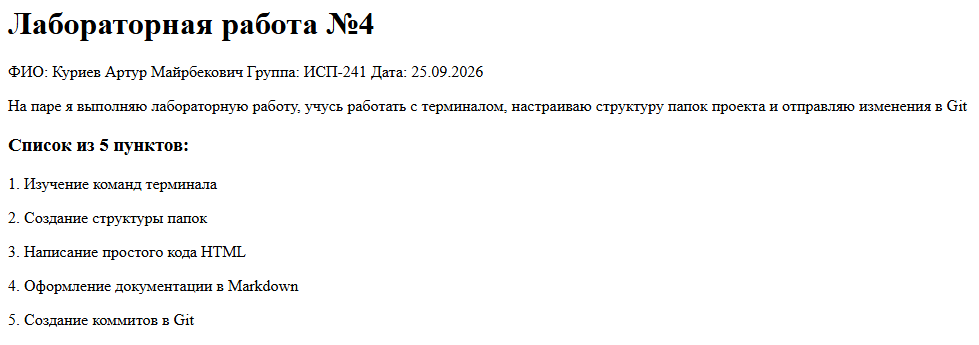
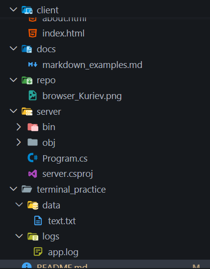
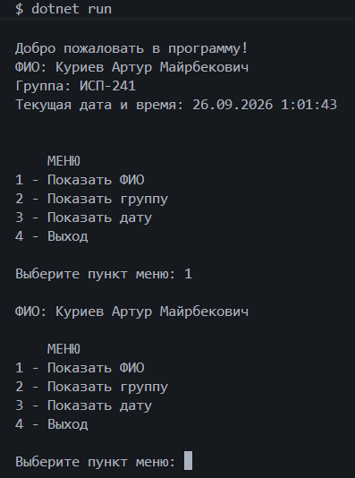

# Лабораторная работа №3

**ФИО:** Куриев Артур Майрбекович
**Группа:** ИСП-241
**Дата:** 26.09.2026

## Описание проекта

В этой лабораторной работе я изучал Markdown и LaTeX, Git, терминалом и структурой проектов.
Я учился создавать заголовки, списки, картинки, ссылки и код, коммитить и пушить на гит, работать с терминалом и структурой проекта.

## Содержание

1. [Описание проекта](#описание-проекта)
2. [Структура проекта](#структура-проекта)
3. [Примеры Markdown](#примеры-markdown)
4. [Пример LaTeX](#пример-latex)
5. [Репозиторий](#репозиторий)
6. [Скриншоты](#скриншоты)
7. [Заключение](#заключение)

## Структура проекта

* `README.md` - основной файл
* `docs/` - файл с MarkDown
* `repo/` - скриншоты
* `server/` - пример кода C#
* `client/` - пример кода HTML
* `terminal_practice/` - работа с терминалом

## Примеры Markdown

### Заголовок

## Список

* Markdown
* Git
* LaTeX

### Картинка



### Код

```csharp
Console.WriteLine("Hello, Markdown!");
```

## Пример LaTeX

Inline-формула: $S = \pi r^2$

Блок-формула:

$$
\sum_{i=1}^n i = \frac{n(n+1)}{2}
$$

## Репозиторий

[Мой репозиторий на GitHub](https://github.com/APTYPMORGAN/Lab4_ISRPO_Kuriev)

## Скриншоты

### Структура


### Рабочая программа в терминале



## Заключение

В этой лабораторной работе я изучил основные возможности Markdown, LaTeX, Git и терминала.
Теперь я могу использовать их для оформления README и документации проекта.